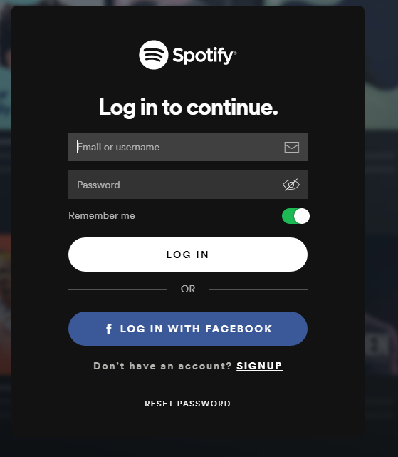
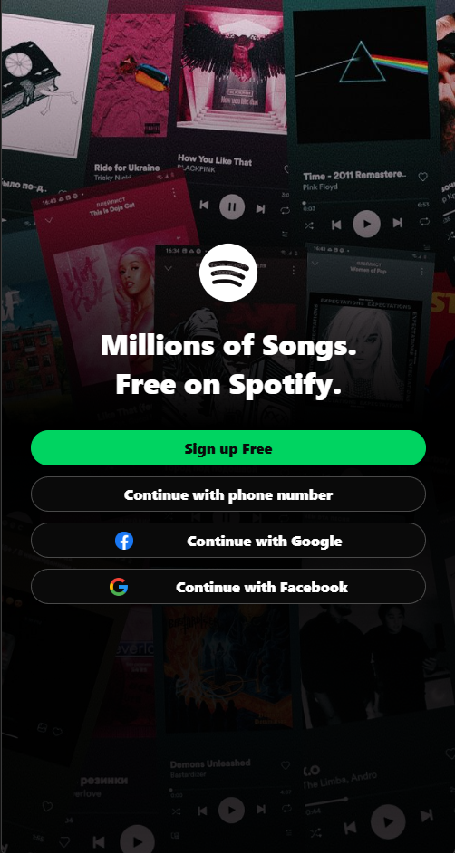
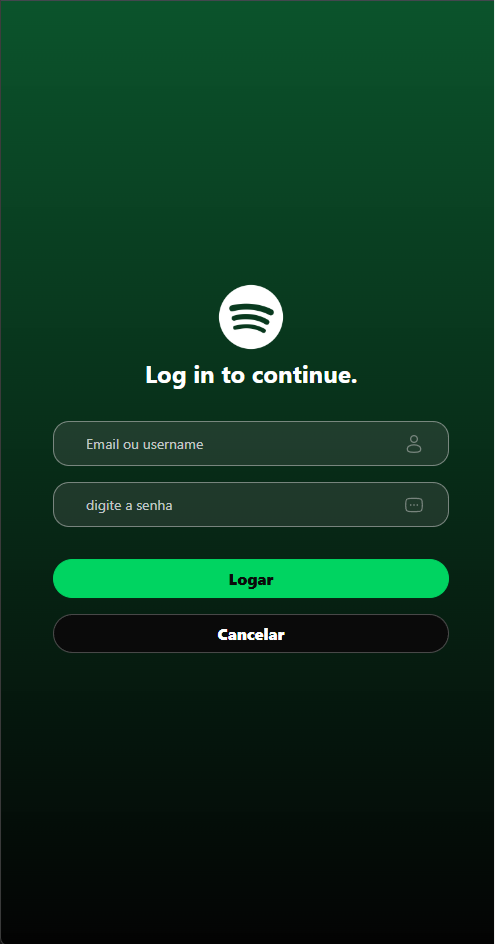

# Trabalho Individual - P3

Este repositório contém a resolução do desafio prático P3, um projeto individual desenvolvido em **React Native** com **TypeScript** para fins acadêmicos. O objetivo principal é replicar fielmente duas páginas de um aplicativo à escolha (clonagem), aplicando estritamente as regras de componentização e estilização nativa exigidas no critério de avaliação.

## 📱 Páginas Clonadas

O desafio consiste em reconstruir duas interfaces com base em uma referência visual, aplicando as melhores práticas de layout mobile, fidelidade visual e estruturação modular.

<table>
  <thead>
    <tr align="center">
      <th></th>
      <th>1ª Página</th>
      <th>2ª Página</th>
    </tr>
  </thead>
  <tbody>
    <tr align="center">
      <td>Exemplos Originais</td>
      <td>
        
      </td>
      <td>
        
      </td>
    </tr>
    <tr align="center">
      <td>Criação (Clone)</td>
      <td>
        
      </td>
      <td>
        
      </td>
    </tr>
  </tbody>
</table>

---

## 📋 Requisitos Técnicos Obrigatórios

Em total conformidade com as diretrizes do projeto (conforme especificado na imagem de requisitos `image_c15d98.jpg`), o projeto foi estritamente construído seguindo as seguintes regras:

- **Trabalho Individual:** Todo o código e arquitetura foram desenvolvidos de forma 100% autónoma.
- **Stack Tecnológica:** Desenvolvido exclusivamente utilizando **TypeScript** (`.tsx` para estrutura e `.ts` para tipos/estilos).
- **Componentes Nativos Utilizados:** A interface foi construída utilizando exclusivamente os componentes nativos essenciais do React Native:
  - `<View>`: Para a estruturação de containers e divisões de layout.
  - `<Text>`: Para renderização e formatação de todas as strings de texto.
  - `<TextInput>`: Para a criação e captura dos campos de entrada de dados (inputs).
  - `<Image>`: Para exibição das mídias e assets visuais.
- **Estilização Isolada (`StyleSheet`):** Toda a folha de estilo foi gerada utilizando a API nativa `StyleSheet.create`. Conforme a regra mandatória, os estilos estão **completamente separados do arquivo estrutural `.tsx`** (organizados em um arquivo dedicado, ex: `styles.ts`), garantindo uma arquitetura limpa e de fácil manutenção.
- **Evidência de Clonagem no Git:** A imagem original utilizada como base de referência para a criação do clone foi incluída no repositório para critérios de comparação direta pelo avaliador.

---

## 🚀 Como Executar o Projeto

Como este é um projeto mobile construído em React Native, certifique-se de ter o ambiente de desenvolvimento mobile configurado (Node.js, JDK, Android Studio ou Xcode/Expo Go).

1. **Clone este repositório:**

   ```bash
   git clone https://github.com/Phonedison/react-native-p3
   ```

2. **Acesse o diretório do projeto:**

   ```bash
   cd simple-application-styled
   ```

3. **Instale as dependências:**

   ```bash
   npm install
   # ou
   yarn install
   ```

4. **Inicie o servidor do ecossistema mobile (Metro Bundler):**
   ```bash
   npm run start
   # ou
   npx react-native start
   # ou se estiver utilizando Expo:
   npx expo start
   ```

> 💡 **Nota:** Para testar e visualizar o comportamento do aplicativo, utilize um emulador (Android/iOS) conectado ou faça o escaneamento do QRCode através do aplicativo **Expo Go** no seu smartphone real.

---

## 🏅 Recompensa e Critério de Sucesso

- **Critério:** Cumprimento integral de todas as regras descritas (TypeScript, Componentes Obrigatórios, Imagem de Referência no Git e StyleSheet isolado).
- **Impacto:** Vale **1,0 ponto na nota final**.

---

## ✒️ Autor

Desenvolvido por **Lucas Leal da Silva** (Phonedison).
